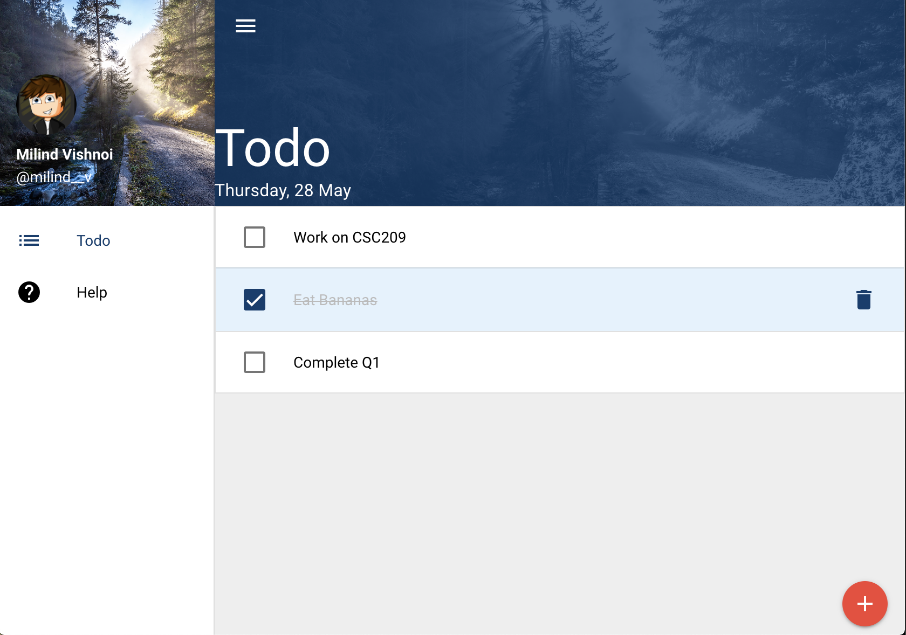

# Quasar Task Manager
This is a small project for learning Quasar.



## Running the project
### Install the dependencies
```bash
npm install
```

### Start the app in development mode (hot-code reloading, error reporting, etc.)
```bash
quasar dev
```


### Build the app for production
```bash
quasar build
```

### Customize the configuration
See [Configuring quasar.conf.js](https://quasar.dev/quasar-cli/quasar-conf-js).
